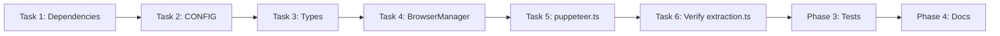

# Implementation Plan: Headless Mode Toggle

**Feature Branch**: `feature/headless-mode-toggle`  
**Spec**: [spec.md](./spec.md)  
**Created**: 2026-01-20  
**Status**: Ready for Implementation

---

## Technical Context

| Aspect | Current State | Target State |
|--------|--------------|--------------|
| **Browser visibility** | Hardcoded `headless: true` in `initializeBrowser()` | Configurable via `PERPLEXITY_HEADLESS` env var |
| **Puppeteer library** | Vanilla `puppeteer` (v24.10.1) | `puppeteer-extra` + stealth plugin |
| **Race condition handling** | Uses `isInitializing` boolean flag | Promise-based lock (`initPromise`) for thread safety |
| **GPU arguments** | Always disabled (headless-optimized) | Conditionally removed for visible mode |

### Key Dependencies

- `puppeteer-extra`: ^3.3.7 (wraps puppeteer with plugin support)
- `puppeteer-extra-plugin-stealth`: ^2.11.2 (Cloudflare evasion)
- Both packages compatible with Node.js 22+ and puppeteer 24.x

---

## Constitution Check

| Requirement | Status | Notes |
|-------------|--------|-------|
| Environment variable config | ✅ Pass | Follows existing pattern (`PERPLEXITY_BROWSER_DATA_DIR`, `PERPLEXITY_PERSISTENT_PROFILE`) |
| Default to safe mode | ✅ Pass | Headless mode is default, explicit `"false"` required to disable |
| No breaking changes | ✅ Pass | All existing APIs preserved, new behavior is opt-in |
| Test coverage required | ✅ Pass | Unit tests for config, integration tests for locking |

---

## Phase 0: Research

### Research Tasks

1. **puppeteer-extra + stealth plugin integration**
   - Decision: Use `puppeteer-extra` as drop-in replacement
   - Rationale: Minimal code changes, stealth plugin auto-applies evasion
   - Alternatives: Manual evasion scripts (current approach, less effective)

2. **Promise-based initialization lock pattern**
   - Decision: Store `initPromise: Promise<void> | null` in `PuppeteerContext`
   - Rationale: Multiple callers await same promise, single initialization
   - Alternatives: Mutex library (overkill), queue system (complex)

3. **Modern headless mode (`'new'`) vs legacy**
   - Decision: Use `'new'` for headless, `false` for visible
   - Rationale: Chrome's new headless is more stable and less detectable
   - Alternatives: Legacy `true` (deprecated behavior)

### Resolved Clarifications

| Question | Answer |
|----------|--------|
| What value enables headless? | Any value except `"false"` (including unset, `"true"`, `"1"`) |
| Does stealth conflict with existing evasion? | No, stealth supplements `setupBrowserEvasion()` |
| How to handle plugin load failure? | Log warning, continue with vanilla puppeteer |

---

## Phase 1: Design & Contracts

### Data Model

```typescript
// src/server/config.ts - Addition to CONFIG
export const CONFIG = {
  // ... existing config ...
  
  /**
   * Browser headless mode control
   * - 'new': Modern headless (default, recommended)
   * - false: Visible browser window for debugging
   */
  HEADLESS: process.env["PERPLEXITY_HEADLESS"] !== "false" ? "new" : false,
} as const;
```

```typescript
// src/types/browser.ts - Addition to PuppeteerContext
export interface PuppeteerContext {
  // ... existing fields ...
  
  /**
   * Promise-based lock for browser initialization
   * Prevents race conditions when multiple tools call initialize concurrently
   */
  initPromise: Promise<void> | null;
  setInitPromise: (promise: Promise<void> | null) => void;
}
```

### API Contracts

**Environment Variable API**:
```
PERPLEXITY_HEADLESS=false  → Visible browser (for debugging/demos)
PERPLEXITY_HEADLESS=true   → Headless browser (default)
PERPLEXITY_HEADLESS=       → Headless browser (default)
(unset)                    → Headless browser (default)
```

**No HTTP/RPC API changes** - this is configuration-only.

---

## Phase 2: Implementation Tasks

### Task 1: Add Dependencies (5 min)

**File**: `package.json`

**Changes**:
```json
{
  "dependencies": {
    "puppeteer-extra": "^3.3.7",
    "puppeteer-extra-plugin-stealth": "^2.11.2"
  }
}
```

**Acceptance**: `pnpm install` succeeds, no peer dependency warnings

---

### Task 2: Add CONFIG.HEADLESS (5 min)

**File**: [src/server/config.ts](../../../src/server/config.ts)

**Changes**:
```typescript
export const CONFIG = {
  // ... existing config ...
  
  // Browser headless mode: 'new' (default) or false (visible)
  HEADLESS: process.env["PERPLEXITY_HEADLESS"] !== "false" ? "new" : false,
} as const;
```

**Acceptance**: 
- `CONFIG.HEADLESS` returns `"new"` when env var is unset or `"true"`
- `CONFIG.HEADLESS` returns `false` when env var is `"false"`

**Test**: Unit test for config parsing

---

### Task 3: Update PuppeteerContext Type (5 min)

**File**: [src/types/browser.ts](../../../src/types/browser.ts#L105-L125)

**Changes**: Add `initPromise` and `setInitPromise` to `PuppeteerContext` interface

```typescript
export interface PuppeteerContext {
  // ... existing fields ...
  initPromise: Promise<void> | null;
  setInitPromise: (promise: Promise<void> | null) => void;
}
```

**Acceptance**: TypeScript compiles without errors

---

### Task 4: Update BrowserManager (10 min)

**File**: [src/server/modules/BrowserManager.ts](../../../src/server/modules/BrowserManager.ts)

**Changes**:
1. Add `initPromise: Promise<void> | null = null` property
2. Add `setInitPromise` to `getPuppeteerContext()` return object
3. Update `initialize()` to use promise-based lock pattern:

```typescript
async initialize(): Promise<void> {
  // If already initializing, wait for existing promise
  if (this.initPromise) {
    logInfo("Browser initialization already in progress, waiting...");
    await this.initPromise;
    return;
  }

  // Create new initialization promise
  this.initPromise = this._doInitialize();
  
  try {
    await this.initPromise;
  } finally {
    this.initPromise = null;
  }
}

private async _doInitialize(): Promise<void> {
  const ctx = this.getPuppeteerContext();
  await initializeBrowser(ctx);
  logInfo("BrowserManager initialized successfully");
}
```

**Acceptance**: 
- Concurrent `initialize()` calls share the same promise
- Lock is released on success or failure

---

### Task 5: Refactor puppeteer.ts for puppeteer-extra (30 min)

**File**: [src/utils/puppeteer.ts](../../../src/utils/puppeteer.ts)

**Changes**:

1. **Import change** (lines 4-5):
```typescript
// Before
import puppeteer, { type Browser, type Page } from "puppeteer";

// After
import puppeteer from "puppeteer-extra";
import type { Browser, Page } from "puppeteer";
import StealthPlugin from "puppeteer-extra-plugin-stealth";

// Apply stealth plugin globally (once at module load)
puppeteer.use(StealthPlugin());
```

2. **Update initializeBrowser** (lines 18-75):
```typescript
export async function initializeBrowser(ctx: PuppeteerContext) {
  // Existing guard for isInitializing (kept for backwards compat)
  if (ctx.isInitializing) {
    logInfo("Browser initialization already in progress...");
    return;
  }
  ctx.setIsInitializing(true);
  
  try {
    if (ctx.browser) {
      await ctx.browser.close();
    }
    
    // Use CONFIG.HEADLESS instead of hardcoded true
    const headless = CONFIG.HEADLESS;
    let browserArgs = generateBrowserArgs(CONFIG.USER_AGENT);

    // Remove GPU-disabling flags when in visible mode
    if (headless === false) {
      browserArgs = browserArgs.filter(arg =>
        !arg.includes('--disable-gpu') &&
        !arg.includes('--disable-accelerated-2d-canvas')
      );
    }

    const browser = await puppeteer.launch({
      headless,  // Now uses CONFIG value: 'new' or false
      args: browserArgs,
      userDataDir: CONFIG.USE_PERSISTENT_PROFILE ? CONFIG.BROWSER_DATA_DIR : undefined,
    });
    
    // ... rest of existing initialization code ...
  } catch (error) {
    // ... existing error handling ...
  } finally {
    ctx.setIsInitializing(false);
  }
}
```

**Acceptance**:
- Browser launches in headless mode by default
- Browser launches visible when `PERPLEXITY_HEADLESS=false`
- Stealth plugin is active (test with bot detection site)

---

### Task 6: Update extraction.ts (5 min)

**File**: [src/utils/extraction.ts](../../../src/utils/extraction.ts)

**Changes**: None required - uses `initializeBrowser` which now respects config

**Verification**: Confirm `initializeBrowser` call at line 75 inherits new behavior

---

## Phase 3: Testing

### Unit Tests

**File**: `src/__tests__/unit/config.test.ts` (new)

```typescript
describe('CONFIG.HEADLESS', () => {
  it('defaults to "new" when env var not set', () => {
    delete process.env.PERPLEXITY_HEADLESS;
    // Re-import config to pick up env change
    const { CONFIG } = await import('../server/config.js');
    expect(CONFIG.HEADLESS).toBe('new');
  });
  
  it('returns false when env var is "false"', () => {
    process.env.PERPLEXITY_HEADLESS = 'false';
    const { CONFIG } = await import('../server/config.js');
    expect(CONFIG.HEADLESS).toBe(false);
  });
  
  it('returns "new" for any other value', () => {
    for (const val of ['true', '1', 'yes', 'TRUE']) {
      process.env.PERPLEXITY_HEADLESS = val;
      const { CONFIG } = await import('../server/config.js');
      expect(CONFIG.HEADLESS).toBe('new');
    }
  });
});
```

**File**: `src/__tests__/unit/browser-manager.test.ts` (extend)

```typescript
describe('BrowserManager.initialize() locking', () => {
  it('handles concurrent initialization requests', async () => {
    const manager = new BrowserManager();
    const initializeBrowserMock = vi.spyOn(puppeteerUtils, 'initializeBrowser')
      .mockImplementation(async () => {
        await new Promise(r => setTimeout(r, 100)); // Simulate delay
      });
    
    // Call initialize twice simultaneously
    const [result1, result2] = await Promise.all([
      manager.initialize(),
      manager.initialize(),
    ]);
    
    // Should only call actual initialization once
    expect(initializeBrowserMock).toHaveBeenCalledTimes(1);
  });
  
  it('releases lock on failure', async () => {
    const manager = new BrowserManager();
    vi.spyOn(puppeteerUtils, 'initializeBrowser')
      .mockRejectedValueOnce(new Error('Init failed'))
      .mockResolvedValueOnce(undefined);
    
    await expect(manager.initialize()).rejects.toThrow('Init failed');
    
    // Second call should succeed (lock released)
    await expect(manager.initialize()).resolves.not.toThrow();
  });
});
```

### Integration Tests

**File**: `src/__tests__/integration/headless-mode.test.ts` (new)

```typescript
describe('Headless Mode Toggle (Integration)', () => {
  // Note: These tests require actual browser launch
  // Skip in CI if no display available
  
  it.skipIf(process.env.CI)('launches visible browser when HEADLESS=false', async () => {
    process.env.PERPLEXITY_HEADLESS = 'false';
    const manager = new BrowserManager();
    
    await manager.initialize();
    
    // Browser should exist and not be headless
    expect(manager.browser).not.toBeNull();
    
    await manager.cleanup();
  });
});
```

---

## Phase 4: Documentation

### README Updates

Add to README.md:

```markdown
## Configuration

### Environment Variables

| Variable | Description | Default |
|----------|-------------|---------|
| `PERPLEXITY_HEADLESS` | Browser visibility mode. Set to `"false"` for visible browser (debugging). | `"true"` (headless) |
| `PERPLEXITY_BROWSER_DATA_DIR` | Path for persistent browser profile | `~/.perplexity-mcp` |
| `PERPLEXITY_PERSISTENT_PROFILE` | Enable persistent browser profile | `"true"` |

### Debugging with Visible Browser

To debug browser automation issues, run the server with visible browser:

```bash
PERPLEXITY_HEADLESS=false bun run start
```

> **Note**: Visible mode requires a display server. Will fail on headless CI/servers.
```

---

## Implementation Order



**Estimated Total Time**: 2-3 hours

---

## Success Verification Checklist

- [ ] `pnpm install` - Dependencies install without errors
- [ ] `pnpm build` - TypeScript compiles without errors
- [ ] `pnpm test` - All existing tests pass
- [ ] `pnpm test` - New unit tests pass
- [ ] Manual test: `PERPLEXITY_HEADLESS=false bun run start` shows browser
- [ ] Manual test: Default startup runs in headless mode
- [ ] Manual test: Concurrent tool calls don't create multiple browsers
- [ ] README documents new environment variable

---

## Risk Mitigation

| Risk | Mitigation |
|------|------------|
| puppeteer-extra version mismatch | Pin versions, test with puppeteer 24.10.1 |
| Stealth plugin breaks existing evasion | Stealth supplements, doesn't replace `setupBrowserEvasion` |
| CI failures on headless-only servers | Skip integration tests via `it.skipIf(process.env.CI)` |
| Race condition in promise lock | Test with concurrent requests, verify single init call |

---

## Rollback Plan

If issues arise:
1. Revert to vanilla `puppeteer` import
2. Remove `puppeteer-extra` dependencies
3. Keep `CONFIG.HEADLESS` for future use
4. Document in HANDOFF.md for next iteration
