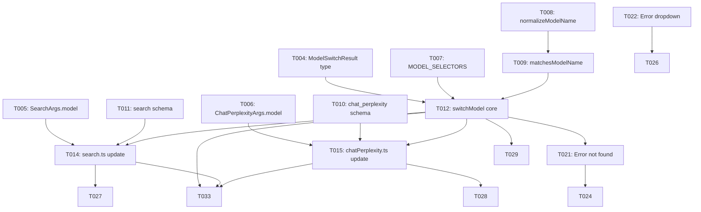

# Tasks: Model Switching

**Input**: Design documents from `/specs/001-model-switching/`  
**Feature Branch**: `001-model-switching`  
**Date Generated**: 2026-01-20

## Format: `[ID] [P?] [Story] Description`

- **[P]**: Can run in parallel (different files, no dependencies)
- **[Story]**: Which user story this task belongs to (US1, US2, US3)
- Exact file paths included in descriptions

## User Stories Summary

| Story | Title | Priority | Independent Test |
|-------|-------|----------|------------------|
| US1 | Switch to a Specific AI Model | P1 🎯 MVP | Call tool with `model` param, verify UI shows selected model |
| US2 | Graceful Handling When Model Not Found | P2 | Call with invalid model, verify descriptive error returned |
| US3 | Default Model Behavior | P3 | Call without `model` param, verify current model used |

---

## Phase 1: Setup (Project Foundation)

**Purpose**: Ensure development environment is ready

- [x] T001 Create feature branch `git checkout -b 001-model-switching`
- [x] T002 Verify test runner works with `pnpm test`
- [x] T003 [P] Review existing puppeteer utilities pattern in src/utils/puppeteer.ts

---

## Phase 2: Foundational (Blocking Prerequisites)

**Purpose**: Types and constants that ALL user stories depend on

**⚠️ CRITICAL**: No user story work can begin until this phase is complete

### Type Definitions

- [x] T004 [P] Add `ModelSwitchResult` interface to src/types/browser.ts
- [x] T005 [P] Add `model?: string` property to `SearchArgs` in src/types/tools.ts
- [x] T006 [P] Add `model?: string` property to `ChatPerplexityArgs` in src/types/tools.ts

### Constants & Helper Functions

- [x] T007 [P] Add `MODEL_SELECTORS` constant to src/utils/puppeteer-logic.ts
- [x] T008 [P] Add `normalizeModelName()` function to src/utils/puppeteer-logic.ts
- [x] T009 Add `matchesModelName()` function to src/utils/puppeteer-logic.ts (depends on T008)

### Schema Updates

- [x] T010 [P] Add `model` property to `chat_perplexity` inputSchema in src/schema/toolSchemas.ts
- [x] T011 [P] Add `model` property to `search` inputSchema in src/schema/toolSchemas.ts

**Checkpoint**: Foundation ready - types, constants, and schemas in place

---

## Phase 3: User Story 1 - Switch to a Specific AI Model (Priority: P1) 🎯 MVP

**Goal**: Users can specify a model and have it selected before query execution

**Independent Test**: Call `search` or `chat_perplexity` with `model: "Claude 3.5 Sonnet"`, verify Perplexity UI shows Claude selected before query runs

### Core Implementation for User Story 1

- [x] T012 [US1] Implement `switchModel()` function in src/utils/puppeteer.ts
  - Use `MODEL_SELECTORS` for resilient element finding (FR-002)
  - Click dropdown trigger, wait for options (FR-004: 5s timeout)
  - Find matching model using `matchesModelName()` (FR-003: case-insensitive)
  - Click option, return `ModelSwitchResult`
  - Log operations using `ctx.log()`

- [x] T013 [US1] Export `switchModel` from src/utils/puppeteer.ts barrel

### Tool Integration for User Story 1

- [x] T014 [US1] Update `search.ts` to call `switchModel()` when `model` provided (FR-009)
  - Add model extraction from args
  - Call `switchModel(ctx, model)` before search execution
  - Handle switchModel result

- [x] T015 [US1] Update `chatPerplexity.ts` to call `switchModel()` when `model` provided (FR-009)
  - Add model extraction from args  
  - Call `switchModel(ctx, model)` before chat execution
  - Handle switchModel result

### Unit Tests for User Story 1

- [x] T016 [P] [US1] Create unit test file src/__tests__/unit/model-switching.test.ts
- [x] T017 [US1] Add unit test: `normalizeModelName` handles various casings
- [x] T018 [US1] Add unit test: `matchesModelName` finds exact matches
- [x] T019 [US1] Add unit test: `matchesModelName` finds partial matches (e.g., "Claude" matches "Claude 3.5 Sonnet")
- [x] T020 [US1] Add unit test: `matchesModelName` is case-insensitive

**Checkpoint**: User Story 1 complete - model switching works for valid models

---

## Phase 4: User Story 2 - Graceful Error Handling (Priority: P2)

**Goal**: Users get clear feedback when requested model doesn't exist

**Independent Test**: Call tool with `model: "NonExistent-Model"`, verify error message includes available models

### Error Handling Implementation for User Story 2

- [x] T021 [US2] Add error handling in `switchModel()` for model not found (FR-005)
  - Throw: `Model "${requestedModel}" not found in dropdown options. Available models: ${list}`

- [x] T022 [US2] Add error handling in `switchModel()` for dropdown access failure (FR-006)
  - Throw: `Could not open model selector dropdown. Please ensure you are logged in.`

- [x] T023 [US2] Add timeout error handling in `switchModel()` 
  - Throw: `Model selector options did not load within 5000ms.`

### Unit Tests for User Story 2

- [x] T024 [P] [US2] Add unit test: throws descriptive error when model not found
- [x] T025 [P] [US2] Add unit test: error message includes available models list
- [x] T026 [P] [US2] Add unit test: throws error when dropdown cannot open

**Checkpoint**: User Story 2 complete - errors are clear and actionable

---

## Phase 5: User Story 3 - Default Model Behavior (Priority: P3)

**Goal**: Tools work normally when no model is specified (backward compatibility)

**Independent Test**: Call `search` without `model` param, verify no model switching occurs and query executes with current model

### Default Behavior Implementation for User Story 3

- [x] T027 [US3] Verify `search.ts` skips `switchModel()` when `model` undefined (FR-008)
  - Add conditional: `if (model) { await switchModel(ctx, model); }`

- [x] T028 [US3] Verify `chatPerplexity.ts` skips `switchModel()` when `model` undefined (FR-008)
  - Add conditional: `if (model) { await switchModel(ctx, model); }`

### Optimization for User Story 3

- [x] T029 [US3] Add early return in `switchModel()` when model already selected
  - Check current selection before opening dropdown
  - Return `{ success: true, wasAlreadySelected: true }` if match

### Unit Tests for User Story 3

- [x] T030 [P] [US3] Add unit test: search tool works without model parameter
- [x] T031 [P] [US3] Add unit test: chatPerplexity tool works without model parameter
- [x] T032 [P] [US3] Add unit test: switchModel returns early when model already selected

**Checkpoint**: User Story 3 complete - full backward compatibility maintained

---

## Phase 6: Integration Tests & Polish

**Purpose**: End-to-end validation and code quality

### Integration Tests

- [ ] T033 Create integration test file src/__tests__/integration/model-switching.test.ts
- [ ] T034 Add integration test: switch to Claude 3.5 Sonnet and verify selection
- [ ] T035 Add integration test: switch to GPT-4o and verify selection
- [ ] T036 Add integration test: measure switch duration is under 3s (SC-001)
- [ ] T037 Add integration test: case-insensitive matching works (SC-005)

### Code Quality & Documentation

- [x] T038 [P] Add JSDoc comments to all new public functions
- [x] T039 [P] Update README.md with model switching usage examples
- [x] T040 Run full test suite: `pnpm test`
- [x] T041 Run linter: `pnpm lint`
- [ ] T042 Manual E2E verification: test all 3 user stories in real browser

**Final Checkpoint**: All user stories implemented and tested

---

## Dependencies

## Parallel Execution Opportunities

### Phase 2 (Can all run in parallel):
- T004, T005, T006, T007, T008, T010, T011

### Phase 3 (After T012 completes):
- T014 and T015 can run in parallel
- T016-T020 (unit tests) can run in parallel

### Phase 4 (After T021-T023 complete):
- T024, T025, T026 can run in parallel

### Phase 5 (After T027-T029 complete):
- T030, T031, T032 can run in parallel

### Phase 6:
- T033-T037 are sequential (integration tests)
- T038, T039 can run in parallel

---

## Implementation Strategy

### MVP Scope (User Story 1 only)
If time-constrained, implementing only Phases 1-3 delivers a working model switching feature:
- Users can switch models ✅
- Works with search and chat_perplexity ✅
- Case-insensitive matching ✅

### Full Feature (All User Stories)
Complete Phases 1-6 for production-ready feature:
- Error handling with clear messages
- Backward compatibility
- Performance optimization (early return)
- Comprehensive test coverage

---

## Success Criteria Mapping

| SC | Criterion | Tasks | Validation |
|----|-----------|-------|------------|
| SC-001 | Switch in <3s | T012, T036 | Integration test measures duration |
| SC-002 | 95% success rate | T007, T012 | Multiple selector fallbacks |
| SC-003 | Clear errors in <6s | T021-T023 | Unit tests verify messages |
| SC-004 | Backward compatible | T027, T028, T030, T031 | Tests without model param |
| SC-005 | Case-insensitive | T008, T019, T020, T037 | Unit + integration tests |

---

## Estimated Effort

| Phase | Tasks | Effort |
|-------|-------|--------|
| Phase 1: Setup | T001-T003 | 0.5h |
| Phase 2: Foundational | T004-T011 | 1.5h |
| Phase 3: US1 (MVP) | T012-T020 | 3h |
| Phase 4: US2 | T021-T026 | 1.5h |
| Phase 5: US3 | T027-T032 | 1h |
| Phase 6: Polish | T033-T042 | 2.5h |
| **Total** | **42 tasks** | **~10h** |

---

## Quick Reference: File Changes

| File | Action | Tasks |
|------|--------|-------|
| src/types/browser.ts | ADD `ModelSwitchResult` | T004 |
| src/types/tools.ts | MODIFY `SearchArgs`, `ChatPerplexityArgs` | T005, T006 |
| src/utils/puppeteer-logic.ts | ADD `MODEL_SELECTORS`, helpers | T007, T008, T009 |
| src/utils/puppeteer.ts | ADD `switchModel()` | T012, T013, T021-T023, T029 |
| src/tools/search.ts | MODIFY: add model param handling | T014, T027 |
| src/tools/chatPerplexity.ts | MODIFY: add model param handling | T015, T028 |
| src/schema/toolSchemas.ts | MODIFY: add model to schemas | T010, T011 |
| src/__tests__/unit/model-switching.test.ts | NEW | T016-T020, T024-T026, T030-T032 |
| src/__tests__/integration/model-switching.test.ts | NEW | T033-T037 |
