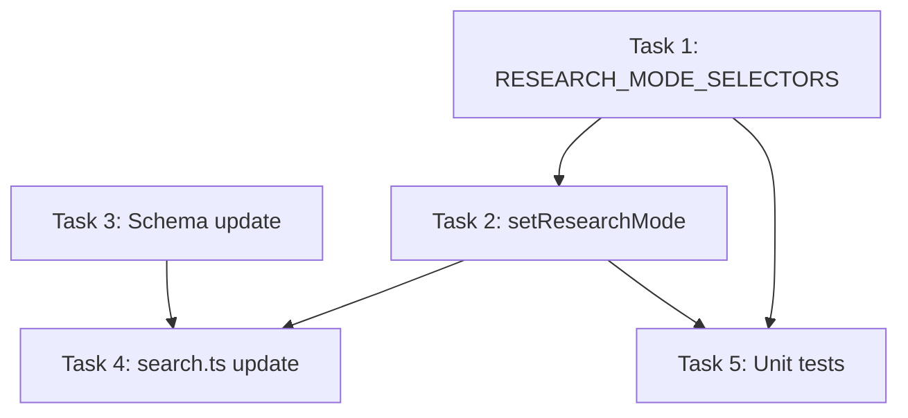

```markdown
# Implementation Plan: Research Mode Toggle

**Branch**: `001-research-mode-toggle` | **Date**: January 20, 2026  
**Spec**: [spec.md](./spec.md)
**Input**: Feature specification from `/specs/001-research-mode-toggle/spec.md`

## Summary

Add a research mode toggle feature that switches between "search" (fast answers) and "deep-research" (comprehensive analysis) modes in the Perplexity web UI. The implementation follows the existing model-switching pattern, using `aria-selected` checks to avoid redundant clicks and multiple selector fallbacks for resilience.

## Technical Context

**Language/Version**: TypeScript 5.x (ES2022 target)  
**Primary Dependencies**: Puppeteer, puppeteer-extra-plugin-stealth  
**Storage**: N/A (stateless browser automation)  
**Testing**: Vitest (unit tests)  
**Target Platform**: Node.js MCP Server (macOS/Linux)  
**Project Type**: Single MCP server project  
**Performance Goals**: Mode toggle within 1 second (SC-001), 95% state detection accuracy (SC-002)  
**Constraints**: 500ms UI stabilization delay after toggle, graceful degradation if element not found  
**Scale/Scope**: Single feature addition to existing tool

## Constitution Check

*GATE: Must pass before Phase 0 research. Re-check after Phase 1 design.*

| Gate | Status | Notes |
|------|--------|-------|
| Test-First Development | ✅ PASS | Unit tests for pure logic (selectors, state detection) written first |
| Single Responsibility | ✅ PASS | Research mode is a self-contained puppeteer utility like model-switching |
| Existing Pattern Reuse | ✅ PASS | Follows MODEL_SELECTORS and switchModel() patterns exactly |
| Graceful Degradation | ✅ PASS | FR-007 requires proceeding if toggle not found |

## Project Structure

### Documentation (this feature)

```text
specs/001-research-mode-toggle/
├── spec.md              # Feature specification
├── plan.md              # This file (implementation plan)
├── research.md          # Phase 0 output - N/A (patterns exist)
├── data-model.md        # Phase 1 output - N/A (no new entities)
└── tasks.md             # Phase 2 output (not created by /speckit.plan)
```

### Source Code Changes

```text
src/
├── utils/
│   ├── puppeteer.ts           # Add setResearchMode() function
│   └── puppeteer-logic.ts     # Add RESEARCH_MODE_SELECTORS constant
├── tools/
│   └── search.ts              # Add research_mode parameter
├── schema/
│   └── toolSchemas.ts         # Add research_mode to search schema
└── __tests__/
    └── unit/
        └── research-mode.test.ts  # New test file
```

**Structure Decision**: Following existing patterns - new selectors go in `puppeteer-logic.ts`, new browser automation in `puppeteer.ts`, schema updates in `toolSchemas.ts`, tests mirror the source structure.

---

## Phase 0: Research

### Existing Patterns Analysis

The model-switching feature provides a complete template:

| Pattern | Model Switching | Research Mode (proposed) |
|---------|-----------------|--------------------------|
| Selectors constant | `MODEL_SELECTORS` | `RESEARCH_MODE_SELECTORS` |
| Pure logic function | `normalizeModelName()`, `matchesModelName()` | `isResearchModeActive()` |
| Main function | `switchModel()` | `setResearchMode()` |
| State check | Check current selection | Check `aria-selected` |
| Optimization | Skip if already selected | Skip if already in mode |
| Test file | `model-switching.test.ts` | `research-mode.test.ts` |

### Key Implementation Decisions

1. **Selector Pattern**: Use same priority order as MODEL_SELECTORS (data-testid → aria-label → class-based → fallback)
2. **State Detection**: Check `aria-selected="true"` attribute (per spec assumption)
3. **Default Behavior**: 'search' mode when `research_mode` parameter not specified (FR-002)
4. **UI Stabilization**: 500ms delay after toggle (per spec assumption)
5. **Error Handling**: Log warning and proceed if toggle element not found (FR-007)

---

## Phase 1: Design & Contracts

### 1.1 New Type: ResearchMode

```typescript
// src/types/index.ts (add to existing types)
export type ResearchMode = 'search' | 'deep-research';
```

### 1.2 New Constant: RESEARCH_MODE_SELECTORS

```typescript
// src/utils/puppeteer-logic.ts (following MODEL_SELECTORS pattern)
export const RESEARCH_MODE_SELECTORS = {
  /** Mode toggle container */
  toggleContainer: [
    '[data-testid="research-mode-toggle"]',
    '[data-testid="mode-toggle"]',
    '[aria-label*="research mode" i]',
    '[aria-label*="mode toggle" i]',
    '[class*="ResearchModeToggle"]',
    '[class*="research-mode"]',
    '[class*="mode-toggle"]',
  ],
  /** Search mode button selectors */
  searchModeButton: [
    '[data-testid="search-mode"]',
    '[aria-label="Search" i]',
    '[aria-label*="search mode" i]',
    'button[class*="search-mode"]',
    '[class*="SearchMode"]',
  ],
  /** Deep Research mode button selectors */
  deepResearchButton: [
    '[data-testid="deep-research-mode"]',
    '[data-testid="research-mode"]',
    '[aria-label="Deep Research" i]',
    '[aria-label*="deep research" i]',
    '[aria-label*="comprehensive" i]',
    'button[class*="deep-research"]',
    'button[class*="research-mode"]',
    '[class*="DeepResearch"]',
  ],
  /** Active state indicator */
  activeIndicator: [
    '[aria-selected="true"]',
    '[data-selected="true"]',
    '[class*="selected"]',
    '[class*="active"]',
  ],
} as const;
```

### 1.3 New Function: setResearchMode()

```typescript
// src/utils/puppeteer.ts
export async function setResearchMode(
  ctx: PuppeteerContext,
  mode: ResearchMode,
): Promise<{ success: boolean; mode: ResearchMode; wasAlreadyActive: boolean }> {
  // 1. Validate page initialized
  // 2. Get current mode via aria-selected check
  // 3. If already in requested mode, return early (optimization)
  // 4. Find and click the appropriate mode button
  // 5. Wait 500ms for UI stabilization
  // 6. Return result
}
```

### 1.4 Schema Update: search tool

```typescript
// src/schema/toolSchemas.ts - add to search inputSchema.properties
research_mode: {
  type: "string",
  enum: ["search", "deep-research"],
  description: "Optional: Research mode - 'search' for quick answers (default), 'deep-research' for comprehensive analysis.",
  examples: ["search", "deep-research"],
},
```

### 1.5 Tool Update: search.ts

```typescript
// src/tools/search.ts - add research_mode handling after model switching
if (research_mode) {
  await setResearchMode(ctx, research_mode);
}
```

---

## Phase 2: Implementation Tasks

### Task 1: Add RESEARCH_MODE_SELECTORS (puppeteer-logic.ts)

**File**: `src/utils/puppeteer-logic.ts`  
**Change**: Add `RESEARCH_MODE_SELECTORS` constant after `MODEL_SELECTORS`  
**Acceptance**: Exports the selector constant, follows same structure as MODEL_SELECTORS

### Task 2: Add setResearchMode() function (puppeteer.ts)

**File**: `src/utils/puppeteer.ts`  
**Change**: Add `setResearchMode()` export function following `switchModel()` pattern  
**Acceptance**:
- Checks current mode before clicking (FR-003)
- Uses fallback selectors (FR-004)
- 500ms stabilization delay (FR-005)
- Graceful degradation if element not found (FR-007)

### Task 3: Update search tool schema (toolSchemas.ts)

**File**: `src/schema/toolSchemas.ts`  
**Change**: Add `research_mode` property to search tool inputSchema  
**Acceptance**: Schema validates 'search' | 'deep-research' enum values

### Task 4: Update search tool implementation (search.ts)

**File**: `src/tools/search.ts`  
**Change**: 
- Add `research_mode` to args type
- Call `setResearchMode()` before performSearch (after model switch)
**Acceptance**: Research mode is set before query execution

### Task 5: Add unit tests (research-mode.test.ts)

**File**: `src/__tests__/unit/research-mode.test.ts`  
**Change**: Create new test file following `model-switching.test.ts` pattern  
**Tests**:
- RESEARCH_MODE_SELECTORS constant structure
- isResearchModeActive() pure function (if extracted)
- Integration smoke test with mocked page

---

## Dependency Order



**Execution Order**: T1 → T3 (parallel with T1) → T2 → T4 → T5

---

## Risk Mitigation

| Risk | Mitigation |
|------|------------|
| UI selectors don't match Perplexity | Multiple fallback selectors + warn and proceed |
| aria-selected not reliable | Also check CSS classes for active state |
| Toggle delay too short | Configurable delay (500ms default) |
| Mode toggle location changes | Container + button selector separation |

---

## Verification Checklist

- [ ] `pnpm check` passes (lint, test, build, typecheck)
- [ ] Unit tests cover all User Stories from spec
- [ ] Coverage thresholds met (80% lines/functions, 75% branches)
- [ ] No redundant clicks when mode unchanged (SC-003)
- [ ] Graceful degradation tested (FR-007)
```
